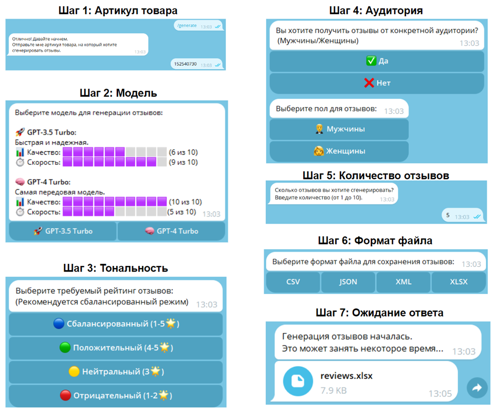
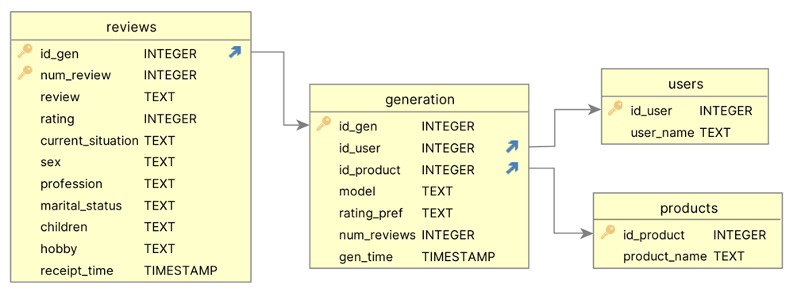

# Wildberries Review Generator Bot

**Wildberries Review Generator Bot** — это Telegram-бот, который генерирует отзывы на товары маркетплейса Wildberries, используя  GPT-модели модели OpenAI. Проект помогает автоматизировать процесс написания отзывов, что может быть полезно для продавцов, покупателей или аналитиков маркетплейсов.

## 📋 Оглавление

- [Описание](#описание)
- [Функциональность](#функциональность)
- [Требования](#требования)
- [Установка](#установка)
- [Использование](#использование)
- [Примеры команд](#примеры-команд)
- [Структура проекта](#структура-проекта)
- [Настройка переменных окружения](#настройка-переменных-окружения)
- [База данных](#база-данных)
- [Пример отзывов](#пример-сгенерированных-отзывов-модель-gpt-4o)
- [Этические аспекты](#️-этические-аспекты)

## Описание

Wildberries Review Generator Bot — это инструмент, предназначенный для автоматической генерации отзывов о товарах на платформе Wildberries с помощью ИИ. Бот позволяет пользователю ввести артикул товара, выбрать параметры генерации (рейтинг, аудиторию и количество отзывов) и получить результаты в различных форматах (CSV, JSON, XML, XLSX).

Проект поддерживает персонализацию отзывов в зависимости от гендерных предпочтений и типа продукта, создавая максимально реалистичные и разнообразные отзывы

## 🛠️ Функциональность

- Генерация отзывов на основе GPT-3.5 и GPT-4 моделей.
- Настройка рейтинга отзывов: положительные, нейтральные, отрицательные.
- Генерация отзывов с учётом гендерных предпочтений (мужчины или женщины).
- Настройка количества отзывов (от 1 до 10).
- Экспорт сгенерированных отзывов в форматах: CSV, JSON, XML, XLSX.
- Повторная генерация отзывов по запросу.
- Логирование действий пользователей и сохранение данных о генерации в базе данных.
- Интерактивные диалоги в Telegram с пользователями.

## 📦 Требования

Перед началом работы убедитесь, что на вашем компьютере установлены следующие программы и библиотеки:

- **Python 3.9+**
- **SQLite**
- **Telegram Bot API Token** (для управления ботом)
- **OpenAI API Key** (для генерации отзывов)

Библиотеки, необходимые для работы, можно установить с помощью файла `requirements.txt`.

## 🚀 Установка

Следуйте этим шагам для установки и настройки проекта локально:

1. **Клонируйте репозиторий**:
   ```bash
   git clone https://github.com/ваш-аккаунт/ваш-репозиторий.git
   cd ваш-репозиторий
2. **Создайте и активируйте виртуальное окружение:**
    ```bash
    python3 -m venv venv
    source venv/bin/activate  # для Linux/Mac
    .\venv\Scripts\activate   # для Windows
3. **Установите зависимости:**:
    ```bash
    pip install -r requirements.txt
4. **Запустите скрипт для создания базы данных:**
   ```bash
   python database.py
   ```
5. **Переменные окружения**:
    ```
    Создайте файл .env и настройте переменные окружения (см. Настройка переменных окружения).
## 🤖 Использование

После запуска бота откройте Telegram, найдите своего бота по имени и отправьте ему команду `/start`. Бот предложит ввести артикул товара и выбрать параметры генерации.

**Пример диалога с ботом**:

- Введите артикул товара (6-9 цифр).
- Выберите модель генерации (GPT-3.5 или GPT-4).
- Выберите предпочтения по рейтингу (положительный, нейтральный, отрицательный).
- Укажите количество отзывов (до 10).
- Выберите формат файла для выгрузки.

После этого бот начнет генерацию отзывов и отправит вам файл с результатами.


## 💡 Примеры команд

- `/start` — Начало работы с ботом.
- `/generate` — Генерация отзывов вручную.
- `/autogenerate` — Автоматическая генерация отзывов по умолчанию.
- `/regenerate` — Повторная генерация ранее созданных отзывов.

## 🏗 Архитектура проекта

```
├── bot.py               # Основной файл Telegram-бота
├── revgen.py            # Логика генерации отзывов с использованием GPT
├── preprompt.py         # Настройка промптов для персонализации отзывов
├── wbparser.py          # Модуль получения информации о товарах 
├── database.py          # Скрипт создания базы данных
├── requirements.txt     # Список зависимостей для проекта
└── README.md            # Текущий файл с описанием проекта
```

Проект состоит из нескольких ключевых модулей, каждый из которых выполняет свою функцию для обеспечения процесса генерации отзывов.

- **Модуль `wbparser`** отвечает за извлечение информации о товаре с веб-сайта Wildberries. Этот модуль выполняет запрос к веб-сайту, получает данные о товаре, такие как описание, характеристики и цена, и передает их для дальнейшей обработки.
- **Модуль `preprompt`** реализует шаблоны для составления запросов к модели. Эти шаблоны содержат необходимые элементы для того, чтобы модель могла правильно сгенерировать отзыв на основе полученных данных о товаре.
- **Модуль `revgen`** собирает все шаблоны в единый промпт, который отправляется модели для генерации отзывов. Этот модуль интегрирует информацию о товаре, полученную от `wbparser`, и подготавливает финальный запрос к модели GPT.
- **Модуль `bot`** обеспечивает взаимодействие пользователя с системой через Telegram-бота. Этот модуль обрабатывает команды, получаемые от пользователя, и отвечает за передачу данных между пользователем и другими модулями системы.

Ниже представлена упрощенный алгоритм процесса генерации одного отзыва:

**Процесс генерации отзыва:**

1. **Пользователь инициирует процесс генерации**, отправляя специальную команду боту. Бот запрашивает артикул товара и параметры генерации (например, количество отзывов, их тональность и формат файла).
2. **Проверка существования товара**: Модуль `wbparser` отправляет запрос к веб-сайту Wildberries для проверки наличия товара с указанным артикулом. Если товар не существует, бот уведомляет пользователя об ошибке.
3. **Получение данных о товаре**: Если артикул товара существует, `wbparser` извлекает данные о товаре и передает их в модуль `revgen`.
4. **Создание запроса для модели**: В модуле `revgen` собираются шаблоны из `preprompt`, которые содержат описание товара и дополнительную информацию. Эти шаблоны передаются модели GPT для генерации десяти потенциальных ситуаций покупки товара.
5. **Выбор ситуации и генерация промпта**: Из сгенерированных ситуаций случайным образом выбирается одна. Затем шаблоны заполняются контекстуальной информацией, объединяются в единый итоговый промпт и отправляются модели для генерации отзыва.
6. **Генерация отзыва**: Модель возвращает готовый отзыв, который записывается в файл в формате, выбранном пользователем (CSV, JSON, XML или XLSX).
7. **Отправка результата пользователю**: Полученный файл с отзывом отправляется пользователю в чат Telegram.

> **Примечание:** Представленное описание является обобщающим, и некоторые аспекты системы были опущены для упрощения восприятия основной концепции.


## ⚙️ Настройка переменных окружения
Создайте файл `.env` в корневой директории проекта и добавьте следующие переменные:
```bash
TG_API_TOKEN=<Ваш_Telegram_Bot_API_токен>
OPENAI_API_KEY=<Ваш_OpenAI_API_ключ>
DB_PATH=<Путь_к_вашей_базе_данных>
```

## 💾 База данных
Проект использует SQLite для хранения данных о пользователях, товарах и сгенерированных отзывах. База данных содержит следующие таблицы:

* users — Информация о пользователях, взаимодействующих с ботом.
* products — Информация о товарах, по которым генерируются отзывы.
* generation — История генерации отзывов, включая параметры генерации.
* reviews — Сохранённые отзывы с дополнительными метаданными (пол, профессия и т.д.).
  


## 📝 Пример сгенерированных отзывов (Модель GPT-4o)

Ниже приведены примеры отзывов, сгенерированных ботом для товара MacBook Pro:

### Пример 1: Положительный отзыв (Целевая аудитория: Женщины)

> **Рейтинг:** ⭐⭐⭐⭐⭐  
> **Текст:**  
> "Прекрасный ноутбук! Получила его, и он превзошел все ожидания. Работает быстро и плавно, экран просто великолепен — яркий, четкий, отличная цветопередача. Очень порадовала клавиатура, удобная для длительной работы. На замене устройства я не жалею ни разу — теперь все необходимые программы работают без каких-либо зависаний. И, конечно, время автономной работы на высоте."

### Пример 2: Положительный отзыв (Целевая аудитория: Женщины)

> **Рейтинг:** ⭐⭐⭐⭐⭐  
> **Текст:**  
> "Получила свой новый Macbook Pro, и я в восторге! ✨ Он просто летает, а экран с невероятным качеством. Все выглядит так ярко и четко, что работать на нем - одно удовольствие. Радует и длительное время работы от батареи, теперь не нужно постоянно таскать с собой зарядку."

### Пример 3: Положительный отзыв (Целевая аудитория: Женщины)
> **Рейтинг:** ⭐⭐⭐  
> **Текст:**  
> "Пользуюсь этим ноутбуком уже довольно долго и могу сказать, что он действительно мощный и справляется с задачами на ура. Производительность на высоте, особенно при работе с графикой и монтажом видео. Однако клавиатура без русской раскладки может быть неудобной, если вы не привыкли к английским буквам."

### Пример 4: Негативный отзыв (Целевая аудитория: Женщины)

> **Рейтинг:** ⭐⭐  
> **Текст:**  
> "Заказала ноутбук, ожидала с нетерпением, но, к сожалению, ждал почти 3 недели. За это время могла бы выбрать другой товар и давно получить его. Настолько долгое ожидание просто испортило все впечатление от покупки."

### Пример 5: Негативный отзыв (Целевая аудитория: Женщины)

> **Рейтинг:** ⭐  
> **Текст:**  
> "Купила этот ноутбук с большим ожиданием, но он полностью разочаровал. Клавиатура без русской раскладки — это крайне неудобно. Переходник для вилки тоже не включён в комплект. При простых задачах, таких как работа с текстом, он жужжит, а батарея садится быстрее, чем ожидалось."

## ⚖️ Этические аспекты
Использование системы для фальсификации отзывов может нарушать законодательство. Основное предназначение проекта — создание синтетических наборов данных для обучение моделей детекции сгенерированных отзывов.

## 🚧 Будущие улучшения
* Поддержка других маркетплейсов (например, Ozon).
* Возможность генерации отзывов на нескольких языках.
* Интеграция с другими языковыми моделями.